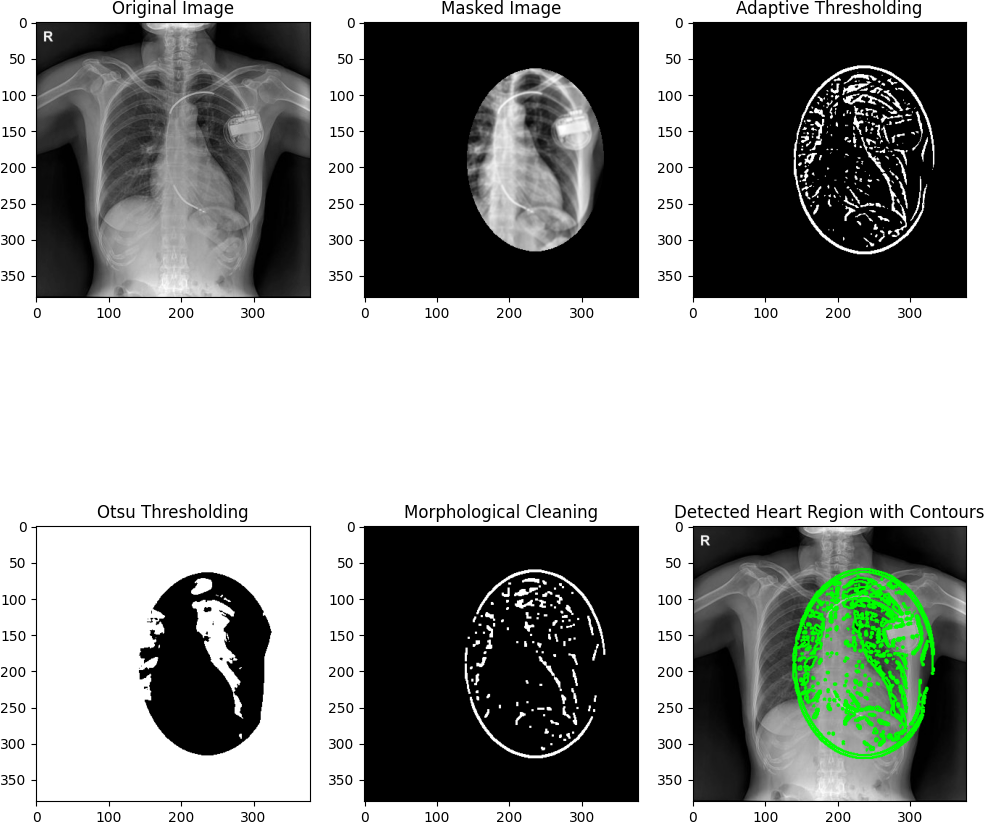

# RTG Heart Detection

## Project Description

This application processes and analyzes chest X-ray images using classical methods to identify the heart region. The project includes the implementation and comparison of various segmentation and edge detection techniques, such as:

- Otsu Thresholding
- Adaptive Thresholding
- Edge Detection (Canny, Sobel)
- Morphological Operations

The goal was to develop an application enabling a comparative analysis of the effectiveness of classical image processing methods in detecting the heart structure on medical images.

## Algorithms and Techniques

1. **Preprocessing:**
   - CLAHE (Contrast Limited Adaptive Histogram Equalization)
   - Gaussian Blur
   - Normalization
   - Histogram Equalization

2. **Image Analysis:**
   - Binary Thresholding
   - Contour Detection
   - Bounding Box for Region of Interest (ROI)

3. **Approaches:**
   - Contour detection using thresholding and edge detectors
   - Masking the ROI
   - Interactive user-based region marking

## Results

Classical methods proved effective for segmenting the heart region, although precise edge detection of the heart structure requires further refinement. Key findings include:

- Accurate segmentation of the heart region.
- Challenges in edge detection due to artifacts and image complexity.

## Example Outputs

### Heart detection using classical methods:

## Future Development

- Integrating classical methods with neural networks, e.g., for preprocessing or image normalization.
- Improving segmentation algorithms to enhance heart edge detection accuracy.
